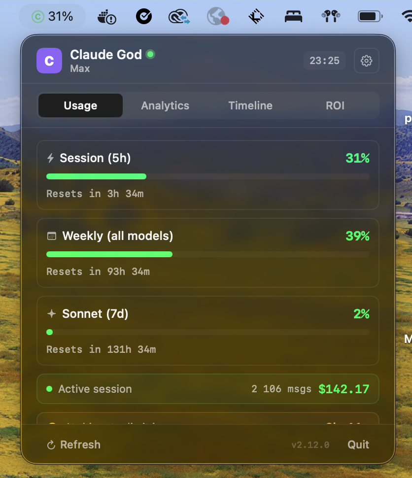
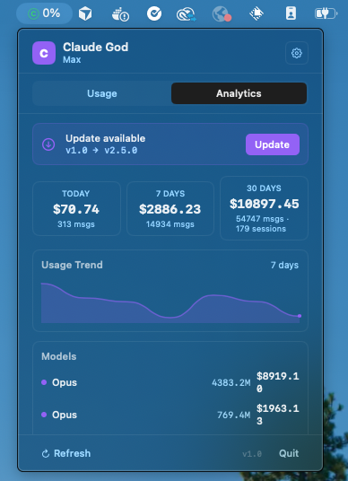

<p align="center">
  
  
  
  
  <a href="https://github.com/Lcharvol/Claude-God/actions/workflows/ci.yml"></a>
</p>

<h1 align="center">
  Claude God
</h1>

<p align="center">
  <strong>Monitor your Claude AI usage from the macOS menu bar.</strong><br>
  Real-time quotas, cost analytics, burn rate prediction, project breakdown.<br>
  Free, open source, zero dependencies.
</p>

<p align="center">
  
  &nbsp;&nbsp;
  
</p>

<p align="center">
  <a href="https://github.com/Lcharvol/Claude-God/releases/latest/download/ClaudeGod.dmg"><strong>Download .dmg</strong></a> &nbsp;&middot;&nbsp;
  <a href="https://claudegod.app">Website</a> &nbsp;&middot;&nbsp;
  <a href="https://github.com/Lcharvol/Claude-God/releases">Changelog</a>
</p>

---

## Features

| | Feature | Description |
|---|---|---|
| **Quotas** | Progress bars | Animated bars for session (5h), weekly, Sonnet & Opus quotas |
| | Dynamic icon | Menu bar icon turns green/orange/red based on worst quota |
| | Live countdown | Real-time timer showing when quotas reset |
| | Burn rate | Predicts when you'll hit the limit based on current velocity |
| | Model advisor | Smart tips when quota imbalance is detected |
| **Analytics** | Cost tracking | Daily, weekly, monthly cost breakdown from JSONL session files |
| | Project breakdown | Per-project cost and session count |
| | Session history | Recent conversations with topic, duration, cost, model |
| | Sparkline chart | Interactive usage trend (7/14/30 days) with hover tooltips |
| | Model breakdown | Per-model cost and token usage with totals |
| | Daily budget | Set a $/day target with progress tracking |
| | Export CSV | Save daily cost & token data as CSV |
| | Copy stats | One-click copy of formatted stats to clipboard |
| **Live** | Active session | Detects when Claude Code is running (green dot) |
| | Auto-credentials | File watcher auto-detects `claude login` |
| | Reset notification | Get notified when quotas reset |
| **Settings** | Auto-refresh | Configurable interval (1, 2, 5, 10 min) |
| | Menu bar modes | Icon only, Session %, Timer, All quotas |
| | Compact mode | Minimal UI showing just percentages |
| | Notifications | Alert when usage exceeds configurable threshold |
| | Launch at login | Start automatically with macOS |
| **Design** | shadcn/ui style | Flat, minimal, bordered cards with hover effects |
| | Dark & Light | Adapts to system appearance automatically |
| | Accessibility | VoiceOver labels on all interactive elements |

> **No API key needed.** Uses your existing `claude login` credentials. Works with Pro & Max plans. Completely free.

---

## Quick Start

### Homebrew (recommended)

```bash
brew tap lcharvol/tap
brew install --cask claude-god
```

### Manual

```bash
# 1. Download & install
open https://github.com/Lcharvol/Claude-God/releases/latest/download/ClaudeGod.dmg

# 2. Allow unsigned app (required once)
xattr -cr /Applications/Claude\ God.app
```

### Then

```bash
# Make sure you're logged in
claude login

# Launch — a "C" icon appears in the menu bar, press ⌥⌘C to toggle
open /Applications/Claude\ God.app
```

---

## How It Works

**Quotas** — The app reads your OAuth credentials from `claude login` (Keychain or `~/.claude/.credentials.json`) and calls:

```
GET https://api.anthropic.com/api/oauth/usage
Authorization: Bearer <oauth_token>
anthropic-beta: oauth-2025-04-20
```

Returns utilization for each quota window (`five_hour`, `seven_day`, `seven_day_sonnet`, `seven_day_opus`). Tokens are refreshed automatically.

**Cost Analytics** — Parses all `~/.claude/projects/**/*.jsonl` session files to calculate costs per model using Anthropic's published pricing.

---

## Build from Source

```bash
git clone https://github.com/Lcharvol/Claude-God.git
cd Claude-God
brew install xcodegen    # one time
make build               # or: make open (Xcode)
```

See [`Makefile`](Makefile) for all commands: `build`, `run`, `dmg`, `clean`.

## Project Structure

```
Sources/
├── ClaudeUsageApp.swift     # Entry point, MenuBarExtra
├── UsageManager.swift       # OAuth, auto-refresh, notifications, budget, active session
├── AuthManager.swift        # Credential loading, token refresh, file watcher
├── UpdateChecker.swift      # GitHub releases auto-update
├── HotkeyManager.swift      # Global ⌥⌘C hotkey (Carbon API)
├── AppShortcuts.swift       # Shortcuts.app intents (Get Usage, Get Cost, Refresh)
├── MenuBarView.swift        # UI: cards, stats, settings, heatmap, shadcn components
├── SessionAnalyzer.swift    # JSONL parser, cost calculator, efficiency metrics
└── Assets.xcassets/         # App icon
Widget/
└── ClaudeGodWidget.swift    # WidgetKit — desktop quota gauges
```

**Zero external dependencies.** Foundation + SwiftUI + Combine + Security + UserNotifications + ServiceManagement.

## Releasing

```bash
git tag v2.8.0 && git push origin v2.8.0
# GitHub Actions builds the .dmg automatically
```

## Roadmap

- [x] Multiple model quotas (Sonnet, Opus, weekly)
- [x] Cost analytics from JSONL files
- [x] Interactive sparkline chart (7/14/30d)
- [x] Export CSV / copy stats
- [x] Burn rate prediction
- [x] Per-project cost breakdown
- [x] Session history with topics
- [x] Active session detection
- [x] Daily budget tracking
- [x] Model advisor tips
- [x] Reset notifications
- [x] Auto-detect credentials
- [x] VoiceOver accessibility
- [x] Global keyboard shortcut (⌥⌘C)
- [x] Homebrew cask distribution

### v2.8.0

- [x] macOS Desktop Widget (WidgetKit) — quota gauges on the desktop
- [x] Usage heatmap — GitHub-style calendar showing daily usage intensity
- [x] Live session cost — real-time cost counter for the active Claude Code session
- [x] Week-over-week comparison — "This week vs last week" delta view
- [x] Per-project budget — set a monthly $ limit per project with alerts
- [x] Efficiency metrics — cost/message trend, avg tokens/session, cache hit rate
- [x] Shortcuts.app integration — expose "Get usage" and "Refresh" as Shortcuts actions
- [x] Multi-account support — switch between work/personal Claude accounts
- [x] Custom alert rules — "Notify me when Opus 7d > 60%" with per-quota thresholds
- [x] Session annotations — tag or star sessions for later reference

## License

[MIT](LICENSE)
